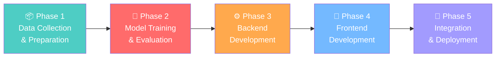

# 🌿 Plant Disease AI — Project Phases Overview

> **Total Phases:** 5 | **Estimated Duration:** 6–8 weeks (college team of 3–4)

---

## Phase Map

---

## Phase Breakdown

| Phase | Name | What Happens | Depends On | Est. Time |
|---|---|---|---|---|
| **Phase 1** | Data Collection & Preparation | Download datasets, organize folders, create train/val/test splits, plan augmentation | Nothing | 3–4 days |
| **Phase 2** | Model Training & Evaluation | Train all 3 CNN gates, evaluate performance, export models | Phase 1 |  1–2 weeks |
| **Phase 3** | Backend Development | Build FastAPI server, database, auth, prediction API, integrate trained models | Phase 2 | 1–2 weeks |
| **Phase 4** | Frontend Development | Build Flutter mobile app, screens, camera integration, API calls | Phase 3 | 1–2 weeks |
| **Phase 5** | Integration & Deployment | Dockerize everything, connect all pieces, test end-to-end, team setup | Phase 3 + 4 | 3–5 days |

> [!TIP]
> **Phase 3 and Phase 4 can run in parallel** if one teammate works on backend while another works on Flutter. They just need to agree on the API contract (endpoints + request/response format) upfront.

---

## Phase Files

| File | Phase |
|---|---|
| [phase_1_data_preparation.md](file:///C:/Users/vamsi/.gemini/antigravity/brain/7f085e6e-cd54-4d50-bbba-e2fa9de78b1c/artifacts/phase_1_data_preparation.md) | Data Collection & Preparation |
| [phase_2_model_training.md](file:///C:/Users/vamsi/.gemini/antigravity/brain/7f085e6e-cd54-4d50-bbba-e2fa9de78b1c/artifacts/phase_2_model_training.md) | Model Training & Evaluation |
| [phase_3_backend.md](file:///C:/Users/vamsi/.gemini/antigravity/brain/7f085e6e-cd54-4d50-bbba-e2fa9de78b1c/artifacts/phase_3_backend.md) | Backend Development |
| [phase_4_frontend.md](file:///C:/Users/vamsi/.gemini/antigravity/brain/7f085e6e-cd54-4d50-bbba-e2fa9de78b1c/artifacts/phase_4_frontend.md) | Frontend Development |
| [phase_5_deployment.md](file:///C:/Users/vamsi/.gemini/antigravity/brain/7f085e6e-cd54-4d50-bbba-e2fa9de78b1c/artifacts/phase_5_deployment.md) | Integration & Deployment |

---

## Who Works on What (Suggested Team Split)

| Team Member | Responsibilities |
|---|---|
| **Member 1** (ML Lead) | Phase 1 + Phase 2 (data prep + model training) |
| **Member 2** (Backend Lead) | Phase 3 (FastAPI + database + auth) |
| **Member 3** (Frontend Lead) | Phase 4 (Flutter app) |
| **All Members** | Phase 5 (integration + testing together) |

---

## Quick Reference — Tech Stack

| Layer | Technology |
|---|---|
| Frontend | Flutter 3.x, Dart, Riverpod, Dio |
| Backend | Python 3.11+, FastAPI, SQLAlchemy, Pydantic |
| ML/AI | TensorFlow/Keras, EfficientNet, OpenCV, Albumentations |
| Database | PostgreSQL 15 |
| Cache/Broker | Redis 7 |
| Task Queue | Celery |
| Auth | JWT (Access + Refresh tokens) |
| Storage | MinIO (S3-compatible) |
| DevOps | Docker, Docker Compose, Nginx |

---

## Quick Reference — Datasets

| Dataset | Purpose | Link |
|---|---|---|
| **PlantVillage** | Primary dataset — 54K images, 38 classes, 14 crops | [Kaggle](https://www.kaggle.com/datasets/abdallahalidev/plantvillage-dataset) |
| **PlantDoc** | Real-world images — 2,598 images, 13 species | [Kaggle](https://www.kaggle.com/datasets/nirmalsankalana/plantdoc-dataset) |
| **ImageNet Mini** | Non-leaf images for Gate 1 training | [Kaggle](https://www.kaggle.com/datasets/ifigotin/imagenetmini-1000) |
