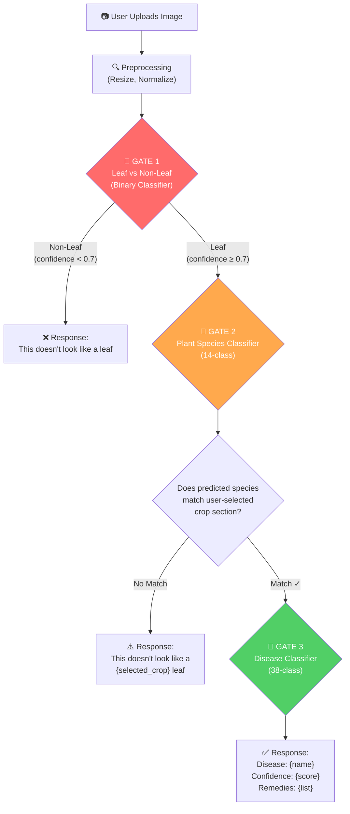
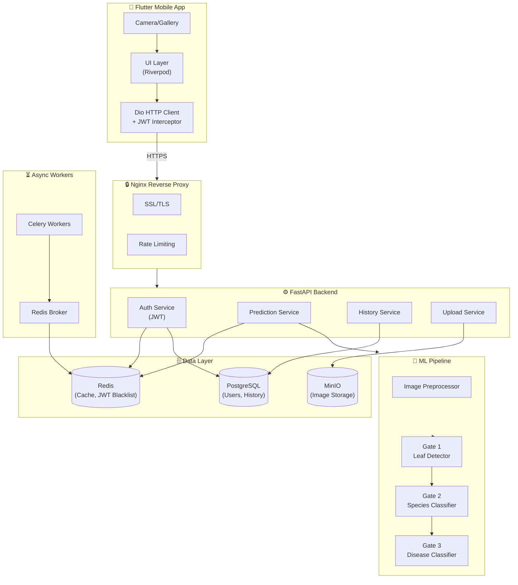
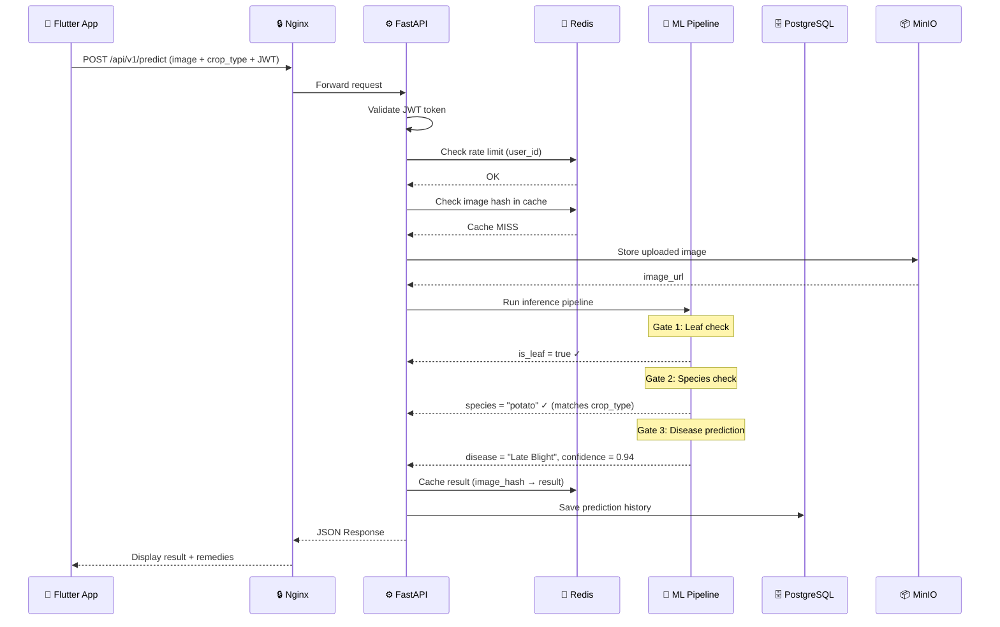
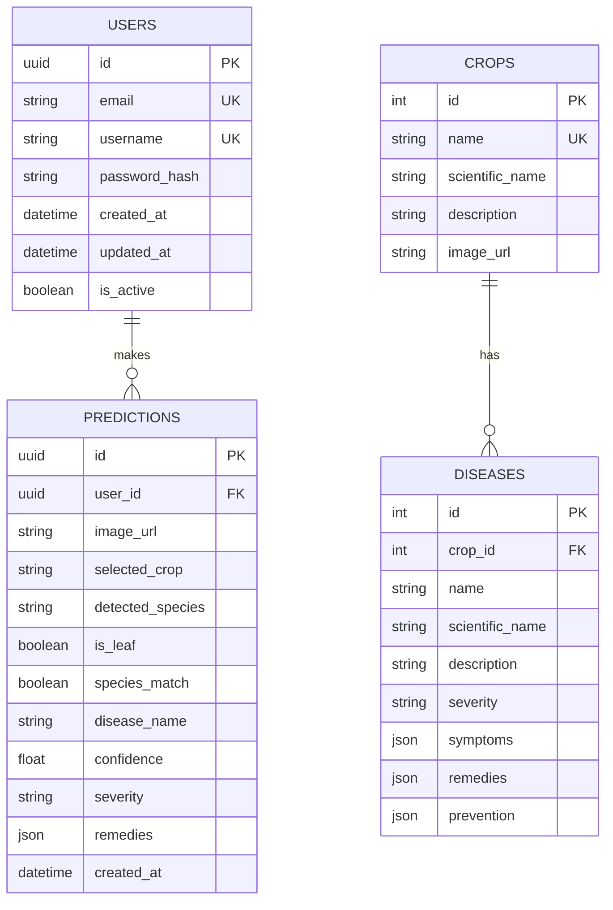
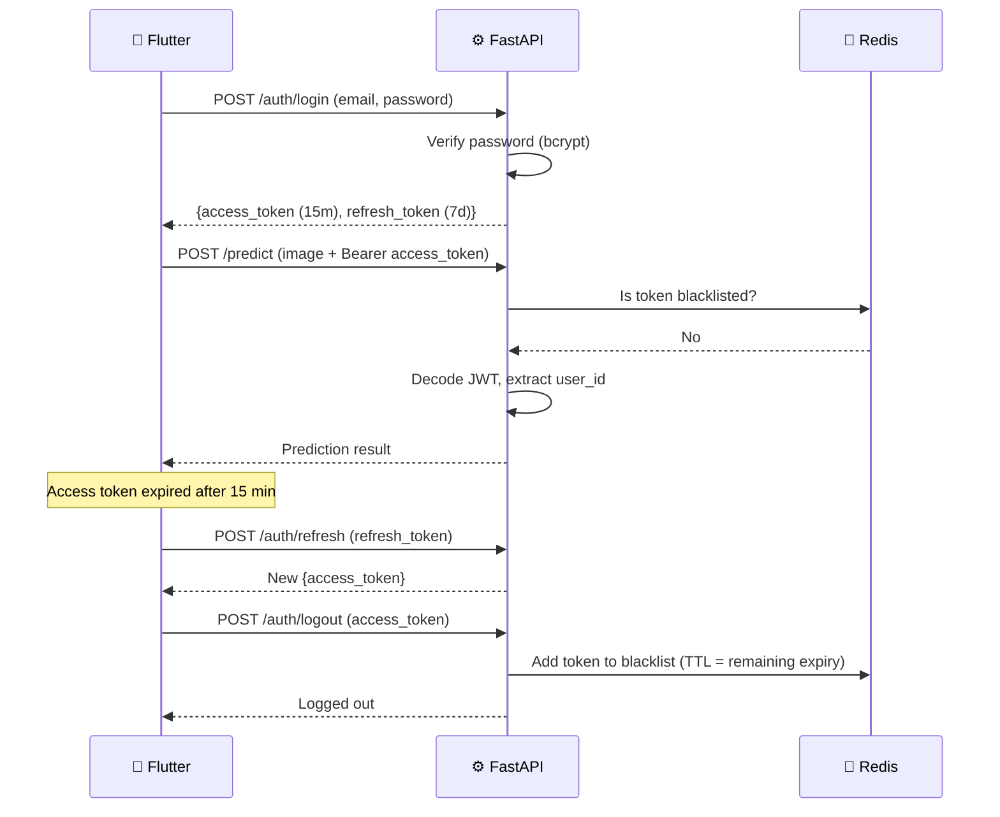

# 🌿 Plant Disease Identification Platform — System Design Document

> **Version:** 1.0 | **Date:** May 2026 | **Type:** Enterprise System Architecture

---

## 1. Problem Statement & Requirements Recap

| # | Requirement | Design Implication |
|---|---|---|
| R1 | Upload/capture leaf photo → predict disease accurately | Multi-class CNN with transfer learning |
| R2 | Detect cross-category mismatch (e.g., strawberry leaf in potato section) | **Plant species classifier** as a validation gate |
| R3 | Detect non-leaf uploads (random objects) | **Leaf vs Non-Leaf binary classifier** as first gate |
| R4 | Python backend + Flutter frontend | FastAPI + Flutter |
| R5 | Reproducible across team members' machines | Docker + Docker Compose |

---

## 2. Complete Tech Stack Breakdown

### 📱 Frontend (Mobile)
| Component | Technology | Why |
|---|---|---|
| Framework | **Flutter 3.x (Dart)** | Single codebase for Android & iOS |
| State Management | **Riverpod** | Modern, testable, compile-safe |
| HTTP Client | **Dio** | Interceptors for JWT, retry logic |
| Camera | **image_picker** package | Camera + gallery support |
| Local Storage | **flutter_secure_storage** | Secure JWT token storage |

### ⚙️ Backend (API Server)
| Component | Technology | Why |
|---|---|---|
| Language | **Python 3.11+** | ML ecosystem, team familiarity |
| Web Framework | **FastAPI** | Async, auto-docs (Swagger), type-safe, fastest Python framework |
| Auth | **JWT (PyJWT + python-jose)** | Stateless authentication |
| ORM | **SQLAlchemy 2.0** | Async DB access |
| Migration | **Alembic** | Database version control |
| Validation | **Pydantic v2** | Request/response validation |

### 🧠 ML / AI Pipeline
| Component | Technology | Why |
|---|---|---|
| Framework | **TensorFlow 2.x / Keras** | Mature, great for CNNs, easy deployment |
| Base Model | **EfficientNetB3** (transfer learning) | Best accuracy-to-size ratio |
| Serving | **TensorFlow Serving** or in-process loading | Low-latency inference |
| Image Processing | **OpenCV + Pillow** | Preprocessing pipeline |
| Data Augmentation | **Albumentations** | Superior augmentation library |

### 🗄️ Data & Storage
| Component | Technology | Why |
|---|---|---|
| Primary DB | **PostgreSQL 15** | Relational data (users, history, feedback) |
| Cache + Broker | **Redis 7** | JWT blacklist, response caching, Celery broker |
| Task Queue | **Celery** | Async heavy tasks (batch processing, retraining) |
| File Storage | **MinIO** (local S3-compatible) | Uploaded images, model artifacts |

### 🐳 DevOps & Reproducibility
| Component | Technology | Why |
|---|---|---|
| Containerization | **Docker + Docker Compose** | Solves "works on my machine" (R5) |
| Reverse Proxy | **Nginx** | Load balancing, SSL termination |
| Monitoring | **Prometheus + Grafana** (optional) | Health metrics |
| Logging | **Python logging + structlog** | Structured JSON logs |

---

## 3. Datasets

### Primary Dataset
| Dataset | Description | Size | Link |
|---|---|---|---|
| **PlantVillage** | 54,305 images across 38 disease classes (14 crop species) | ~3 GB | [Kaggle Link](https://www.kaggle.com/datasets/abdallahalidev/plantvillage-dataset) |

### Supplementary Datasets
| Dataset | Purpose | Link |
|---|---|---|
| **PlantDoc** | Real-world leaf images (2,598 images, 13 species, 17 classes) for robustness | [Kaggle Link](https://www.kaggle.com/datasets/nirmalsankalana/plantdoc-dataset) |
| **ImageNet Mini** | Non-leaf images for the leaf-vs-non-leaf classifier (Gate 1) | [Kaggle Link](https://www.kaggle.com/datasets/ifigotin/imagenetmini-1000) |

### How Datasets Are Used

```
┌─────────────────────────────────────────────────────┐
│              DATASET USAGE MAP                       │
├─────────────────────────────────────────────────────┤
│                                                      │
│  1. Leaf vs Non-Leaf Classifier (Gate 1)            │
│     ├── Leaf images: from PlantVillage + PlantDoc   │
│     └── Non-leaf images: from ImageNet Mini subset  │
│                                                      │
│  2. Plant Species Classifier (Gate 2)               │
│     └── All PlantVillage images grouped by SPECIES  │
│         (14 species: Tomato, Potato, Grape, etc.)   │
│                                                      │
│  3. Disease Classifier (Final Stage)                │
│     └── PlantVillage images grouped by DISEASE      │
│         (38 classes: Tomato_Early_Blight, etc.)     │
│                                                      │
└─────────────────────────────────────────────────────┘
```

---

## 4. CNN Architecture — Three-Stage Inference Pipeline

> [!IMPORTANT]
> This is the **core innovation** of your project. Instead of one monolithic model, we use **3 sequential classifiers** acting as validation gates. This elegantly solves R1, R2, and R3.

### Architecture Overview



### Model Details for Each Gate

#### Gate 1 — Leaf vs Non-Leaf (Binary Classifier)

```
Base Model    : EfficientNetB0 (lightweight, fast)
Input Shape   : (224, 224, 3)
Output        : 2 classes → [Leaf, Non-Leaf]
Training Data : ~30K leaf images + ~15K non-leaf images
Strategy      : Transfer learning, freeze base, train top layers
Threshold     : confidence ≥ 0.70 to pass
```

#### Gate 2 — Plant Species Classifier

```
Base Model    : EfficientNetB3 (higher capacity)
Input Shape   : (300, 300, 3)
Output        : 14 classes → [Tomato, Potato, Grape, Apple, ...]
Training Data : PlantVillage grouped by species (~54K images)
Strategy      : Transfer learning + fine-tuning last 30 layers
Threshold     : Must match user's selected crop section
```

#### Gate 3 — Disease Classifier

```
Base Model    : EfficientNetB3 (same architecture, different weights)
Input Shape   : (300, 300, 3)
Output        : 38 classes → [Tomato_Early_Blight, Potato_Late_Blight, ...]
Training Data : Full PlantVillage with disease labels
Strategy      : Transfer learning + fine-tuning + class weight balancing
Confidence    : Report confidence score to user
```

### Why EfficientNet?

| Model | Top-1 Accuracy (ImageNet) | Parameters | Size |
|---|---|---|---|
| ResNet50 | 76.0% | 25.6M | 98 MB |
| MobileNetV2 | 71.8% | 3.4M | 14 MB |
| **EfficientNetB0** | **77.1%** | **5.3M** | **20 MB** |
| **EfficientNetB3** | **81.6%** | **12M** | **48 MB** |
| EfficientNetB7 | 84.3% | 66M | 256 MB |

> EfficientNet gives the **best accuracy per parameter**. B0 for Gate 1 (speed), B3 for Gates 2 & 3 (accuracy).

### Preprocessing Pipeline

```python
# Standardized preprocessing for all 3 models
def preprocess_image(image_bytes, target_size=(300, 300)):
    img = Image.open(BytesIO(image_bytes)).convert("RGB")
    img = img.resize(target_size)
    img_array = np.array(img) / 255.0          # Normalize to [0, 1]
    img_array = np.expand_dims(img_array, axis=0)  # Add batch dim
    return img_array
```

### Data Augmentation Strategy (Training)

```python
import albumentations as A

train_augmentation = A.Compose([
    A.RandomResizedCrop(300, 300, scale=(0.8, 1.0)),
    A.HorizontalFlip(p=0.5),
    A.VerticalFlip(p=0.3),
    A.RandomBrightnessContrast(p=0.4),
    A.GaussNoise(p=0.2),
    A.Rotate(limit=30, p=0.5),
    A.CoarseDropout(max_holes=8, max_height=30, max_width=30, p=0.3),
])
```

---

## 5. Full System Architecture

### High-Level Architecture Diagram



### Component Interaction — Prediction Flow



---

## 6. Backend API Design

### API Endpoints

| Method | Endpoint | Auth | Description |
|---|---|---|---|
| `POST` | `/api/v1/auth/register` | ❌ | User registration |
| `POST` | `/api/v1/auth/login` | ❌ | Login → returns JWT |
| `POST` | `/api/v1/auth/refresh` | 🔑 | Refresh access token |
| `POST` | `/api/v1/auth/logout` | 🔑 | Blacklist token in Redis |
| `POST` | `/api/v1/predict` | 🔑 | Upload image + crop → get prediction |
| `GET` | `/api/v1/history` | 🔑 | User's prediction history |
| `GET` | `/api/v1/history/{id}` | 🔑 | Single prediction detail |
| `GET` | `/api/v1/crops` | ❌ | List supported crops |
| `GET` | `/api/v1/diseases/{crop}` | ❌ | List diseases for a crop |
| `GET` | `/api/v1/health` | ❌ | Health check |

### Prediction Response Schema

```json
{
  "status": "success",
  "data": {
    "prediction_id": "uuid-here",
    "is_leaf": true,
    "species_match": true,
    "detected_species": "Potato",
    "selected_crop": "Potato",
    "disease": {
      "name": "Late Blight",
      "scientific_name": "Phytophthora infestans",
      "confidence": 0.94,
      "severity": "High"
    },
    "remedies": [
      "Apply copper-based fungicide",
      "Remove and destroy infected leaves",
      "Ensure proper spacing for air circulation"
    ],
    "image_url": "https://storage/images/abc123.jpg",
    "timestamp": "2026-05-03T21:30:00Z"
  }
}
```

### Rejection Response (Non-Leaf)

```json
{
  "status": "rejected",
  "data": {
    "prediction_id": "uuid-here",
    "is_leaf": false,
    "message": "This doesn't look like a leaf. Please upload a clear image of a plant leaf.",
    "confidence": 0.12
  }
}
```

### Rejection Response (Species Mismatch)

```json
{
  "status": "mismatch",
  "data": {
    "prediction_id": "uuid-here",
    "is_leaf": true,
    "species_match": false,
    "detected_species": "Strawberry",
    "selected_crop": "Potato",
    "message": "This doesn't look like a Potato leaf. It appears to be a Strawberry leaf.",
    "confidence": 0.87
  }
}
```

---

## 7. Database Schema



---

## 8. Project Folder Structure

```
plant-disease-ai/
│
├── 📁 docker/                      # Docker configurations
│   ├── docker-compose.yml          # Orchestrates ALL services
│   ├── backend.Dockerfile
│   ├── ml.Dockerfile
│   └── nginx/
│       └── nginx.conf
│
├── 📁 backend/                     # FastAPI Backend
│   ├── app/
│   │   ├── __init__.py
│   │   ├── main.py                 # FastAPI app entry point
│   │   ├── config.py               # Settings (env vars)
│   │   ├── dependencies.py         # Dependency injection
│   │   │
│   │   ├── 📁 api/                 # API routes
│   │   │   ├── v1/
│   │   │   │   ├── auth.py
│   │   │   │   ├── predict.py
│   │   │   │   ├── history.py
│   │   │   │   └── crops.py
│   │   │   └── router.py
│   │   │
│   │   ├── 📁 models/              # SQLAlchemy models
│   │   │   ├── user.py
│   │   │   ├── prediction.py
│   │   │   ├── crop.py
│   │   │   └── disease.py
│   │   │
│   │   ├── 📁 schemas/             # Pydantic schemas
│   │   │   ├── auth.py
│   │   │   ├── predict.py
│   │   │   └── response.py
│   │   │
│   │   ├── 📁 services/            # Business logic
│   │   │   ├── auth_service.py
│   │   │   ├── prediction_service.py
│   │   │   └── history_service.py
│   │   │
│   │   ├── 📁 core/                # Core utilities
│   │   │   ├── security.py         # JWT logic
│   │   │   ├── database.py         # DB connection
│   │   │   └── redis.py            # Redis connection
│   │   │
│   │   └── 📁 tasks/               # Celery tasks
│   │       └── prediction_tasks.py
│   │
│   ├── requirements.txt
│   ├── alembic.ini
│   └── alembic/                    # DB migrations
│
├── 📁 ml/                          # ML Pipeline
│   ├── 📁 models/                  # Saved model weights
│   │   ├── gate1_leaf_detector.h5
│   │   ├── gate2_species_classifier.h5
│   │   └── gate3_disease_classifier.h5
│   │
│   ├── 📁 training/                # Training scripts
│   │   ├── train_gate1.py
│   │   ├── train_gate2.py
│   │   ├── train_gate3.py
│   │   └── evaluate.py
│   │
│   ├── 📁 inference/               # Inference pipeline
│   │   ├── pipeline.py             # 3-gate pipeline orchestrator
│   │   ├── preprocessor.py
│   │   └── postprocessor.py
│   │
│   ├── 📁 data/                    # Datasets (gitignored)
│   │   ├── plantvillage/
│   │   ├── plantdoc/
│   │   └── non_leaf/
│   │
│   ├── 📁 notebooks/               # Jupyter notebooks (EDA)
│   │   ├── 01_data_exploration.ipynb
│   │   ├── 02_training_gate1.ipynb
│   │   └── 03_model_evaluation.ipynb
│   │
│   └── requirements.txt
│
├── 📁 mobile/                      # Flutter App
│   ├── lib/
│   │   ├── main.dart
│   │   ├── 📁 config/              # App configuration
│   │   ├── 📁 models/              # Data models
│   │   ├── 📁 providers/           # Riverpod providers
│   │   ├── 📁 services/            # API service layer
│   │   ├── 📁 screens/             # UI screens
│   │   │   ├── splash_screen.dart
│   │   │   ├── login_screen.dart
│   │   │   ├── home_screen.dart
│   │   │   ├── crop_selection_screen.dart
│   │   │   ├── camera_screen.dart
│   │   │   ├── result_screen.dart
│   │   │   └── history_screen.dart
│   │   ├── 📁 widgets/             # Reusable widgets
│   │   └── 📁 utils/               # Helpers
│   ├── pubspec.yaml
│   └── assets/
│
├── 📁 docs/                        # Documentation
│   ├── API.md
│   ├── SETUP.md
│   └── ARCHITECTURE.md
│
├── .env.example                    # Environment template
├── .gitignore
└── README.md
```

---

## 9. Docker Compose — Reproducibility (Solves R5)

> [!TIP]
> This is how your teammate runs the **entire** project with a single command: `docker-compose up --build`

```yaml
# docker/docker-compose.yml
version: "3.9"

services:
  # --- Nginx Reverse Proxy ---
  nginx:
    image: nginx:alpine
    ports:
      - "80:80"
    volumes:
      - ./nginx/nginx.conf:/etc/nginx/nginx.conf
    depends_on:
      - backend

  # --- FastAPI Backend ---
  backend:
    build:
      context: ../backend
      dockerfile: ../docker/backend.Dockerfile
    env_file: ../.env
    volumes:
      - ../ml/models:/app/ml_models    # Mount trained models
    depends_on:
      - postgres
      - redis

  # --- Celery Worker ---
  celery_worker:
    build:
      context: ../backend
      dockerfile: ../docker/backend.Dockerfile
    command: celery -A app.tasks worker --loglevel=info
    env_file: ../.env
    depends_on:
      - redis
      - backend

  # --- PostgreSQL ---
  postgres:
    image: postgres:15-alpine
    environment:
      POSTGRES_DB: plantdisease
      POSTGRES_USER: admin
      POSTGRES_PASSWORD: ${DB_PASSWORD}
    volumes:
      - pgdata:/var/lib/postgresql/data
    ports:
      - "5432:5432"

  # --- Redis ---
  redis:
    image: redis:7-alpine
    ports:
      - "6379:6379"

  # --- MinIO (Object Storage) ---
  minio:
    image: minio/minio
    command: server /data --console-address ":9001"
    environment:
      MINIO_ROOT_USER: minioadmin
      MINIO_ROOT_PASSWORD: ${MINIO_PASSWORD}
    volumes:
      - minio_data:/data
    ports:
      - "9000:9000"
      - "9001:9001"

volumes:
  pgdata:
  minio_data:
```

### What happens when your teammate runs `docker-compose up`:

```
1. PostgreSQL starts       → Database ready
2. Redis starts            → Cache + message broker ready
3. MinIO starts            → Image storage ready
4. Backend starts          → FastAPI loads ML models into memory
5. Celery Worker starts    → Background task processing ready
6. Nginx starts            → Routes traffic to backend
                           → Everything is running! 🚀
```

---

## 10. Security Design

| Layer | Mechanism | Details |
|---|---|---|
| **Transport** | HTTPS (TLS 1.3) | Nginx handles SSL termination |
| **Authentication** | JWT (Access + Refresh tokens) | Access: 15min, Refresh: 7 days |
| **Token Revocation** | Redis blacklist | Logout invalidates tokens instantly |
| **Rate Limiting** | Nginx + Redis | 10 predictions/minute per user |
| **Input Validation** | Pydantic + file type check | Only JPEG/PNG, max 10MB |
| **Password Storage** | bcrypt (12 rounds) | Via `passlib` library |
| **CORS** | FastAPI middleware | Whitelist mobile app origins |
| **SQL Injection** | SQLAlchemy ORM | Parameterized queries by default |

### JWT Flow



---

## 11. Summary — What Makes This Design Strong

| Aspect | How We Handle It |
|---|---|
| **Accuracy** | EfficientNet transfer learning on 54K+ images, data augmentation |
| **Non-leaf rejection** | Gate 1 binary classifier (Leaf vs Non-Leaf) |
| **Cross-crop validation** | Gate 2 species classifier + user-selected crop comparison |
| **Performance** | Redis caching (repeated images), async FastAPI |
| **Reproducibility** | Docker Compose — single command setup |
| **Security** | JWT + Redis blacklist + rate limiting + input validation |
| **Scalability** | Celery workers can scale horizontally |
| **Maintainability** | Clean architecture, service layer pattern, typed APIs |

---

## 12. Estimated Model Performance Targets

| Gate | Task | Target Accuracy | Target Inference Time |
|---|---|---|---|
| Gate 1 | Leaf vs Non-Leaf | ≥ 95% | < 50ms |
| Gate 2 | Species Classification | ≥ 92% | < 100ms |
| Gate 3 | Disease Classification | ≥ 90% | < 100ms |
| **Total Pipeline** | **End-to-end** | — | **< 300ms** |

---

> [!NOTE]
> This is **Design v1.0**. After your review, I can iterate on any section, add/remove components, or deep-dive into any specific area before we generate the implementation prompts.
